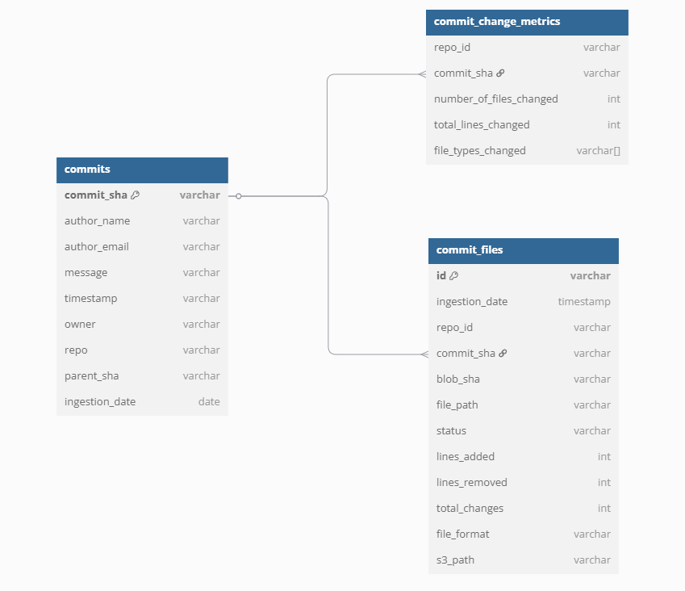
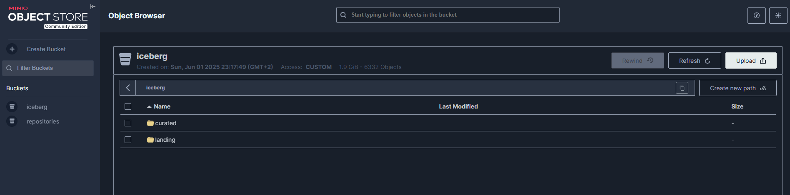
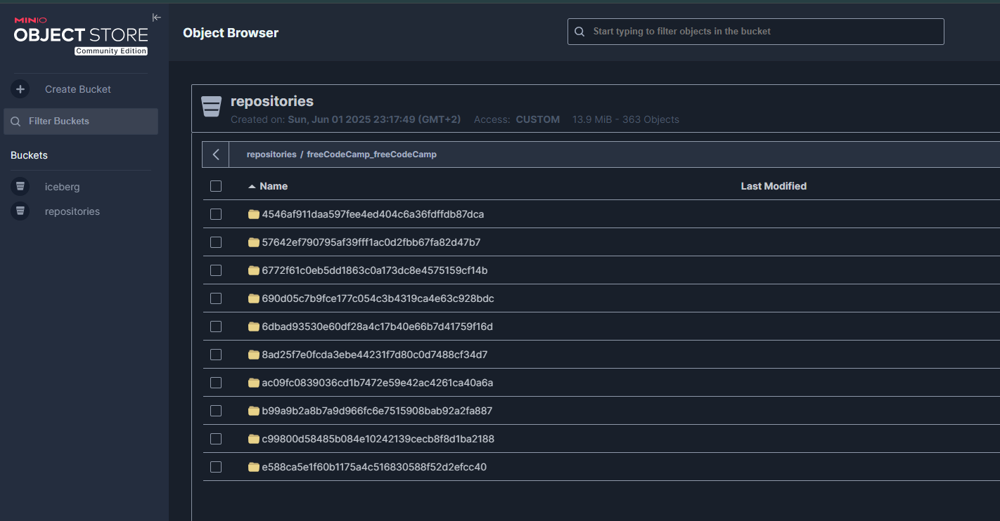
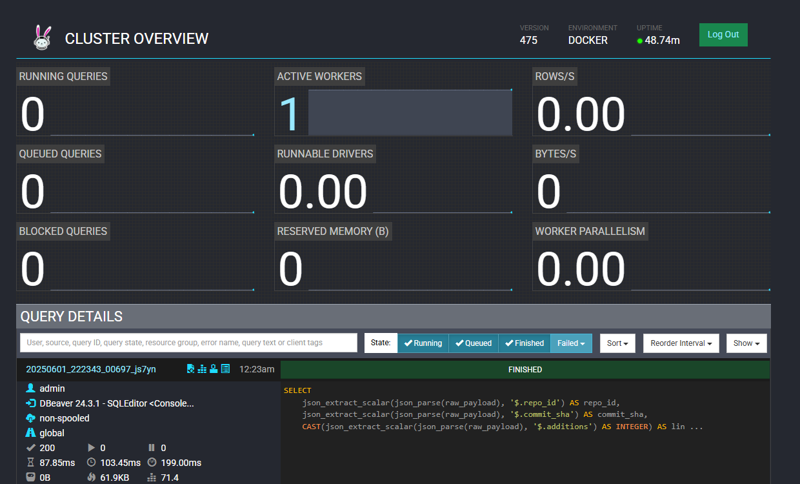
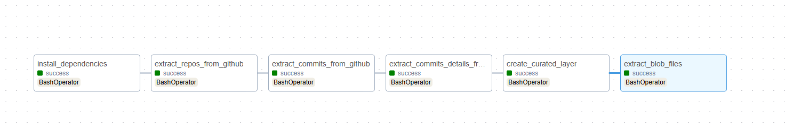

# GitHub Commits Integration Project

This repository has the goal to fill a Data Engineering project.

This project is the integration of GitHub data and making it available for ML models to be trained.

Throughout this document, I will discuss each step I took and the tradeoffs I made when making any decision.

---

## Thought Process

My first thought when reading the provided project description was to break it into Data Engineering terms:

> "For each commit ML team needs commit state before and after commit, commit message and author":

- **"Each commit"**: Commit can be a table or grain for a table in my data schema  
- **"File state"**: Can be a column with file content in a `commit_files` table, or a path to the file  
- **"Commit Message" and "Commit Author"**: Must-have in the data schema  
- **"It would be great if they can restore repo state"**: It's a nice-to-have but not mandatory; however, the commit's SHA must be stored, as it can be used to restore a repo state  
- **"Filter commit based on number/files changed and file/types changed"**: Columns in a dataset — some data transformation will be needed  

> "Data schema must address unknown future requirements":  
We need to use an ELT approach — fetch all the data available and load it to a storage layer.

> "Collect commit data from as many repositories you can":  
Ingest data about org/repositories as well, not only commit specifically. This data can be used later to fetch commits data for each repo dynamically.

> "Store in an S3-like storage":  
Replicate S3 locally instead of creating an AWS account — MinIO can be used.

> "Collect commit in a regular basis with Airflow":  
Use Airflow schedule as a parameter to ingestion jobs — the code must be parameterized by date.

---

Sorry if the above section was too long, but I want to let my thought process be clear before moving into technical and implementation details.

---

## Tools

After defining the requirements, my ideal scenario was the following:

- **Storage**: MinIO + Iceberg  
- **Processing**: PySpark  
- **Orchestration**: Airflow  
- **Dockerization**: Using Docker Compose  
- **Data Exploration**: DBeaver

---

## Storage

I wanted to use Iceberg to allow my data schema to have ACID operations, even though it brings a burden in terms of setup due to the processing engine — native Python doesn't deal too well with it.

For processing, I chose Spark due to its compatibility with Iceberg and my familiarity with it, although I found uncountable issues running it locally — not only for setup but also in terms of development speed.

For this reason, I replaced Spark with Trino, which is a workaround that brings some problems in terms of ingestion — having to use custom INSERT statements instead of Spark’s `write` method.

---

### Final Stack

- **Storage**: MinIO + Iceberg  
- **Catalog**: Nessie (in-memory catalog)  
- **Processing**: Trino + Python  
- **Orchestration**: Airflow  
- **Dockerization**: Using Docker Compose  
- **Data Exploration**: DBeaver

---

## Exploration

To fulfill the requirements, I had to extract:

- Repos information  
- Commits information  
- Files for commits  

For now, GitHub was the only source, so sticking to their API can be handy. Even though rate limits can be a limitation, it's a better experience than using libraries like PyDriller, which require repository cloning (some repos can be heavy).

With GitHub API as the source, I started looking into the API docs that fulfill the given requirements. I found some interesting endpoints:

- `/search/repositories`  
- `/repos/{owner_repo}/commits/{ref}`  
- `/repos/{owner_repo}/contents/{file_path}`  

- The repositories endpoint can be the source table to have repositories info — in this project I'll limit the number of fetched repos.  
- The commits endpoint can bring data about commit metrics and also bring data on the parent commit, which can be used as well to get other state content  
- The content endpoint can be used to download a blob for each file in a given commit  

After exploring the API documentation, I created a TOKEN to work with and started doing some local tests.

---

## Stack Setup

As mentioned before, the idea was to use Spark, but Trino was a replacement for convenience and to unblock development.

Nevertheless, I used Docker Compose and created a network to enable communication across the resources.  
I ended up with two Docker Compose files — one for storage and processing, another for Airflow.

- **Storage**: For storage, I deployed MinIO with Iceberg configurations and also bucket creation. I added post-init scripts to create schemas and landing tables.  
- **Processing**: To handle MinIO and Trino interactions, I created a `utils` package that abstracts this interaction and eases common tasks.  
- **Catalog**: I used the Nessie catalog, which is an alternative to Hive. It's an in-memory catalog and handy for small and local projects.

I also created Python scripts to execute all extraction and transformation workflows. Unfortunately, I had some issues importing those scripts into Airflow and had to copy the whole scripts folder to the Airflow folder as well.

Since the Airflow step was "nice to have", I configured the minimum environment to run the logic — the pipelines are not idempotent and need some extra setup and code adaptation.

---

## Schema Design

Thinking about the critical information I need to keep, I came up with two simple final tables that can be used to fetch what's needed:



I chose to use S3 paths and have a step to fetch each file to the storage instead of storing the content in tables. 

Storing the content in the table can be handy but also brings extra storage cost.  

The downside is that when reading, the ML team will have an extra step when file content is needed.  
This is something that can be discussed to find the best solution together, but for convenience, storing the file in a separate bucket and having a path to it as a column is already useful.

I've separated commits from commit_files also for convenience when ingesting and consuming for each use case.  
Note also that it's possible to join `parent_sha` with `commit_files.id` to get previous file states.  

First commits of repos won't have a parent and also some commits can have multiple parents.  
I'm assuming here the one-parent case only and also ignoring when a commit doesn't have a parent.  
This is an improvement for future iterations and must be addressed to ensure data consistency.

---

## Scripts

After having the schema, I created some scripts for the following steps:

- Extract repositories data  
- Extract commits data based on repos above  
- Extract commit details based on the above commits  
- Extract blob files for each commit/file pair  
- Create curated version of tables  

The scripts make use of utils and do some data wrangling to ease further transformations.

---

## Data Layers

It wasn't mentioned yet, but I chose two layers: `landing` and `curated`.

- **Landing**: Will have only raw data, without unnesting and no schema definition.  
  The downside of this is that we lose track of schema changes and any updates in those tables will require complex logic in the future (like anonymization requests).  
  The choice for being "schemaless" was to facilitate the writing part — since I'm using Trino, I can only use INSERT statements.

- **Curated**: The exposure layer, made using SQL statements, transforming the landing tables into the previously mentioned table schema.

---

### Storage Bucket Samples

- **MinIO Files**:  
  

- **Repositories Bucket**:  
  Repositories bucket is not an Iceberg catalog, but rather a usual blob storage with files for each commit:  
  

- **Trino UI**:  
  Trino can be useful to check query logs and cluster health. Here is an image from Trino's UI from a query:  
  

- **Airflow DAG**:  
  After setting up everything, I created an Airflow folder and a simple DAG responsible for running all the scripts.  
  Please ignore the requirements workaround — I was not able to use my usual Poetry definition easily.  
  

---

## How to Run

To run the project locally, you must have Docker installed.  
Then create a `.env` file with the following variables:

```env
GITHUB_TOKEN=YOUR_TOKEN
LIMIT=10
```

Run the Docker Compose commands:

```bash
docker network create general-network
docker compose -f docker-compose.airflow.yml -f docker-compose.yml up --build -d
```

---

## Final Thoughts

I've tried to be straight to the point and explain my reasoning.  
Unfortunately, I was only able to focus on Sunday and probably some parts of the code can be repetitive or confusing, and not follow the same standards.

The final provided tables can be used by ML teams, but I understand that maybe combining `commits` with `commit_files` can reduce the number of joins if both tables’ data is frequently needed.

Also, the blobs that were stored are not compressed, which is not ideal as well. Repositories can grow really fast and scaling is a real concern.

At the end, the project became bigger than I thought. I was expecting simple ELT/ETL pipelines, but to guarantee ACID and replicate a real-world scenario, I invested some time with the setup and libraries creation.

Please feel free to question me about any part!
